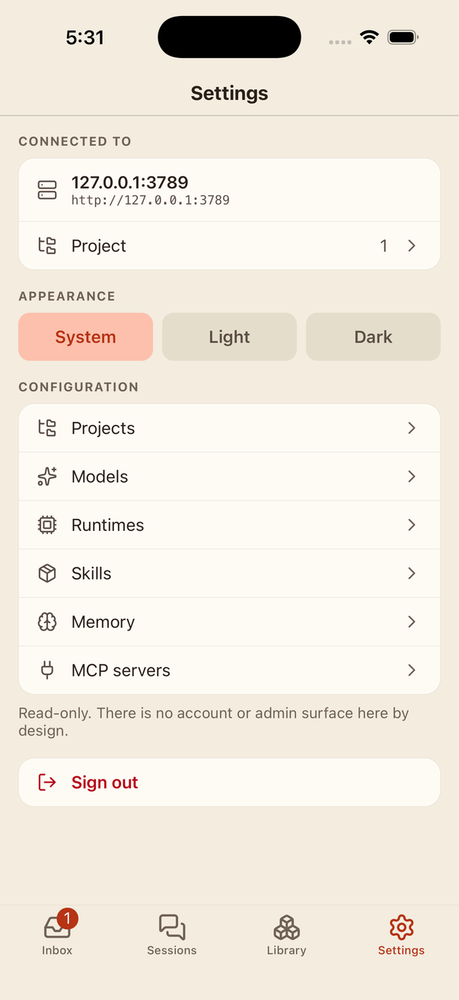

# horsie-mobile

iOS and Android app for [horsie](https://horsie.dev): inbox, sessions and transcripts on your phone.

Point it at any horsie server you can reach. It shows what your agents are saying and asking, lets you answer a question that has parked one, and starts a session. Everything else — agents, environments, workflows, routines, and all settings — is read-only; the web UI is where a deployment is changed.

|  |  |  |  |
|:--:|:--:|:--:|:--:|
| Inbox | Sessions | Library | Settings |

## Status

Early. Not yet in either store.

## What it does

- **Inbox** — what agents have said (`notify_user`) and asked (`ask_user`), project-wide. Answering here unparks the agent.
- **Sessions** — the list, live status, and a full transcript with tool calls, thinking and sub-agents.
- **Graph** — the agent tree, and the run graph behind a workflow run.
- **New session** — pick an agent preset and an environment, say the first thing.
- **Read-only everywhere else** — agents, environments, workflows, routines, projects, models, runtimes, skills, memory.

There is no account or admin surface, by design.

## Running it

```bash
npm install
cd ios && pod install && cd ..
npm run ios      # or: npm run android
```

Bare React Native — no Expo. `ios/` and `android/` are in the repo and are yours to edit.

Sign-in uses horsie's device flow: the app shows a code, opens your browser, and you approve it there. Nothing is typed twice and no password touches the phone.

## Protocol types

Every type on the wire is generated by [fluorite](https://github.com/blossomstack/fluorite) from horsie's own `.fl` schemas, which are vendored under `schemas/` at the ref pinned in `schemas/HORSIE_REF`.

```bash
npm run sync-schemas     # pull the .fl files at the pinned ref
npm run generate-types   # regenerate src/generated
npm run check:schemas    # both, then fail on any diff — this runs in CI
```

To move to a newer horsie, change the SHA in `schemas/HORSIE_REF` and run the first two.

## TestFlight

`scripts/testflight.sh` archives, signs and uploads in one go. Signing is cloud-managed — Xcode mints the certificate and provisioning profile through the App Store Connect API, so nothing is checked in or installed by hand. Put an API key in the environment first:

| Variable | What |
| --- | --- |
| `ASC_KEY_ID` | App Store Connect API key ID |
| `ASC_ISSUER_ID` | that key's issuer ID |
| `ASC_PRIVATE_KEY` | the `.p8` private key, full PEM contents |
| `ASC_TEAM_ID` | Apple Developer team ID |
| `BUILD_KEYCHAIN_PASSWORD` | password for the keychain the build signs in |

The key is written only inside a `mktemp` dir and removed on exit. The build runs in its own keychain rather than the login one, which would be locked in a non-interactive shell; the script restores your keychain setup on exit however it ends.

App Store Connect assigns the build number at upload. Bump `MARKETING_VERSION` in the Xcode project for a new user-visible version.

## Licence

Apache-2.0 OR MIT, at your option. See [LICENSE-APACHE](LICENSE-APACHE) and [LICENSE-MIT](LICENSE-MIT).
