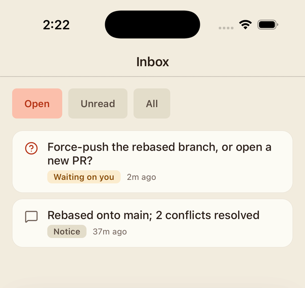
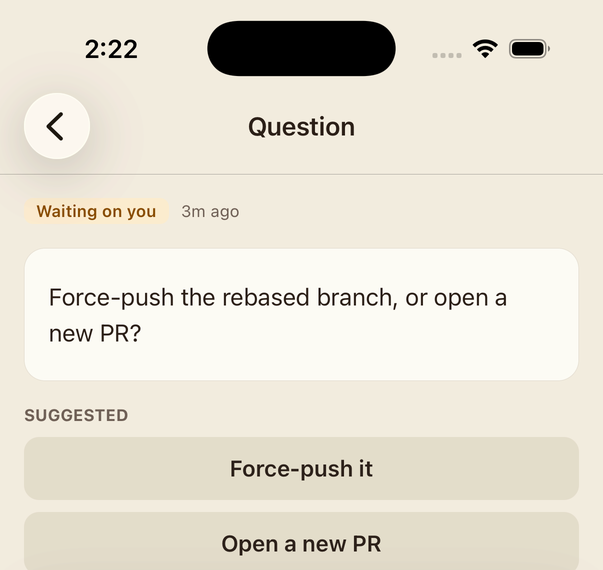
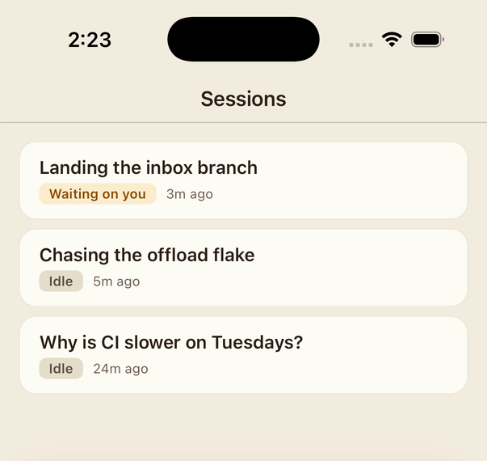
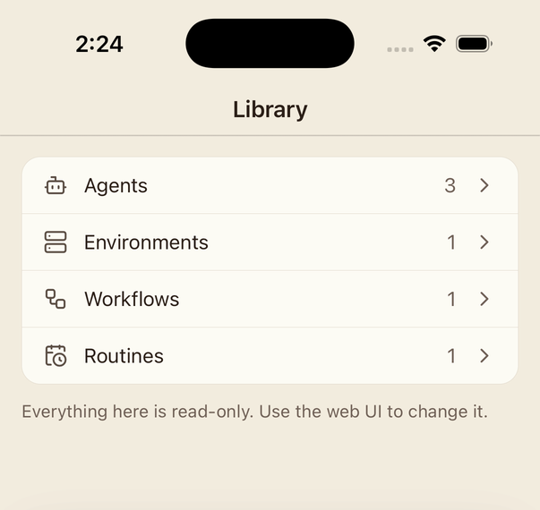

# horsie-mobile

iOS and Android app for [horsie](https://horsie.dev): inbox, sessions and transcripts on your phone.

Point it at any horsie server you can reach. It shows what your agents are saying and asking, lets you answer a question that has parked one, and starts a session. Everything else — agents, environments, workflows, routines, and all settings — is read-only; the web UI is where a deployment is changed.

|  |  |  |  |
|:--:|:--:|:--:|:--:|
|  |  |  |  |
| Inbox | A parked question | Sessions | Library |

## Status

Early. Not yet in either store.

## What it does

- **Inbox** — what agents have said (`notify_user`) and asked (`ask_user`), project-wide. Answering here unparks the agent.
- **Sessions** — the list, live status, and a full transcript with tool calls, thinking and sub-agents.
- **Graph** — the agent tree, and the run graph behind a workflow run.
- **New session** — pick an agent preset and an environment, say the first thing.
- **Read-only everywhere else** — agents, environments, workflows, routines, projects, models, runtimes, skills, memory.

There is no account or admin surface, by design.

## Running it

```bash
npm install
npm run ios      # or: npm run android
```

Sign-in uses horsie's device flow: the app shows a code, opens your browser, and you approve it there. Nothing is typed twice and no password touches the phone.

## Protocol types

Every type on the wire is generated by [fluorite](https://github.com/blossomstack/fluorite) from horsie's own `.fl` schemas, which are vendored under `schemas/` at the ref pinned in `schemas/HORSIE_REF`.

```bash
npm run sync-schemas     # pull the .fl files at the pinned ref
npm run generate-types   # regenerate src/generated
npm run check:schemas    # both, then fail on any diff — this runs in CI
```

To move to a newer horsie, change the SHA in `schemas/HORSIE_REF` and run the first two.

## Shipping

Builds run on EAS, from `eas.json`. Two things have to be done by a human once, because both need an Expo or Apple login that CI cannot produce:

1. `eas init` — writes the real project id into `app.json` (`extra.eas.projectId`), which is a placeholder until then.
2. Add `EXPO_TOKEN` to the repo's Actions secrets, and put the App Store Connect app id into `eas.json` under `submit.production.ios.ascAppId`.

After that, `Build` runs from the Actions tab against the `preview` or `production` profile, and any `v*` tag builds production automatically.

## Licence

Apache-2.0 OR MIT, at your option. See [LICENSE-APACHE](LICENSE-APACHE) and [LICENSE-MIT](LICENSE-MIT).
